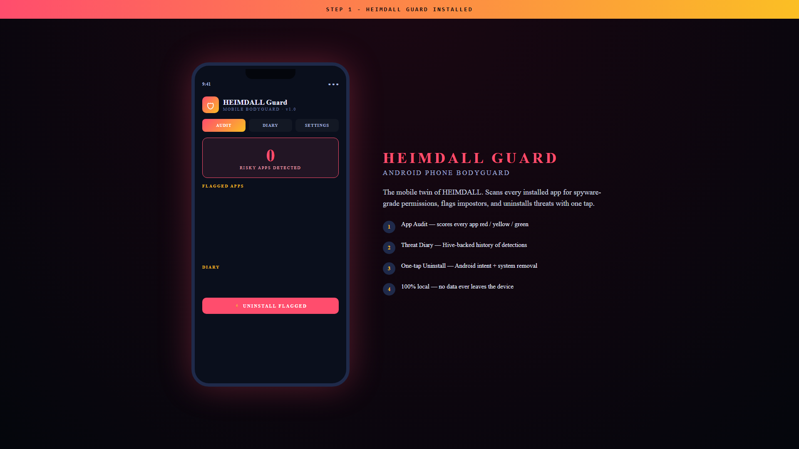

# 🛡️ HEIMDALL Guard

### Mobile Bodyguard — Android twin of HEIMDALL

-orange?style=flat-square)

---

> ## 🔒 Source code is private — request access from my GitHub profile.

---

## What is HEIMDALL Guard

Android app that scans every installed application for **spyware-grade permissions**, scores each one by risk (red / yellow / green), shows you *why* it's risky in one sentence, and lets you **uninstall it with one tap**.

Companion to the desktop [HEIMDALL](https://github.com/Danish-spidy/heimdall-showcase) — same instinct, different platform.

## Demo

https://github.com/user-attachments/assets/cbc3fa61-d01f-4c77-b6f0-8ec6e5d54ae1

## Features

- 📱 **App Audit** — risk-scores every installed app based on its permissions vs its claimed category
- 📓 **Threat Diary** — Hive-backed local history of every detection
- ⚡ **One-tap Uninstall** — Android intent + system removal flow
- 🔒 **100% local** — no data ever leaves the phone, no telemetry, no cloud

## Why it matters

A flashlight app asking for SMS + camera + location is **almost certainly spyware**. But who actually reads Android permissions? HEIMDALL Guard does the reading for you, and helps you act in seconds.

## Built with

- Flutter (cross-platform — ready to port to iOS)
- Native Android Package Manager API
- Hive for fast local storage
- No external services, no API keys

## Contact

For source-code access or a release APK, reach out via my GitHub profile.

## Licence

(c) 2026 Danish · All rights reserved.
